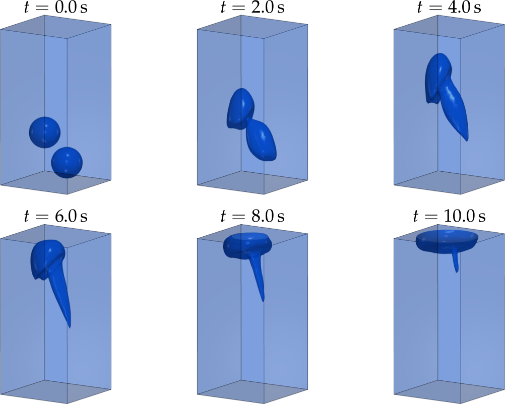
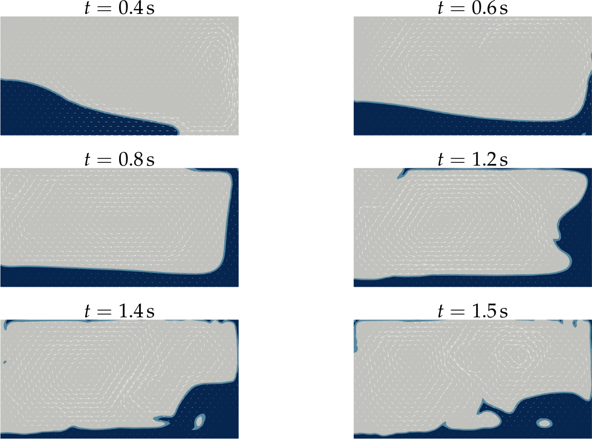
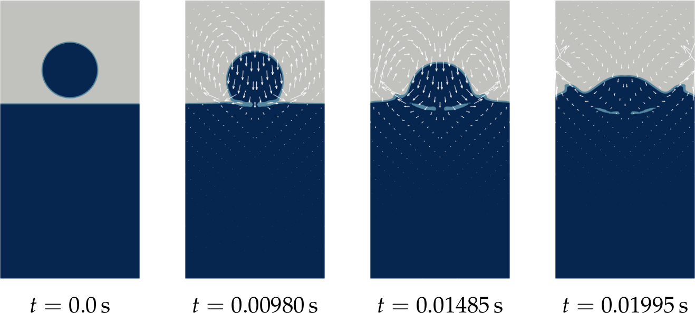

# CFDSolver
### Computational Fluid Dynamics Solver

This is a code for solving partial differential equations of the form resembling Navier-Stokes equations.

Most of the details of the numerical calculations in this solver are presented in our paper:  
[Computers & Fluids, Volume 244, 15 August 2022, 105570](https://doi.org/10.1016/j.compfluid.2022.105570)

Have a look at the [Wiki Page](https://github.com/heySourabh/CFDSolver/wiki) for further details.

#### Developer:
Sourabh Bhat (heySourabh@gmail.com)

--------------
### Some results:
#### Non-axisymmetric bubble rise problem:
   

--------------
#### Dam break problem:
   

--------------
#### Drop splash problem:
   
