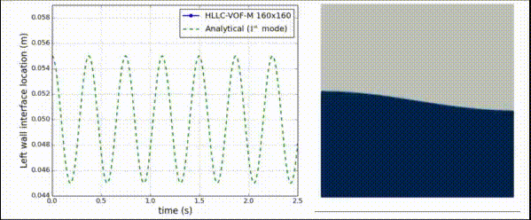

# CFDSolver
### Computational Fluid Dynamics Solver

This is a code for solving partial differential equations of the form resembling Navier-Stokes equations.

Most of the details of the numerical calculations in this solver are presented in our paper:  
[Computers & Fluids, Volume 244, 15 August 2022, 105570](https://doi.org/10.1016/j.compfluid.2022.105570)

If you would like to use the code, you can follow these steps:
1. Clone the GitHub repository to your local computer:  
   `git clone --depth=1 https://github.com/heySourabh/CFDSolver.git`
2. Download OpenJDK20 (or latest JDK) for your operating system ([From Oracle](https://www.oracle.com/java/technologies/downloads/) or [any other vendors](https://foojay.io/today/fantastic-jvms-and-where-to-find-them/)).
3. (Optional but helpful) Install [IntelliJ IDEA](https://www.jetbrains.com/idea/download/): The "Community Edition" is free and open-source.
4. Open the project in IntelliJ IDEA (all necessary dependencies will be automatically downloaded during the first run using maven)
5. Right-click and Run the test problems named `test/main/Solver**.java`
6. Duplicate the Solver in `test/main/` & modify the code as needed for your application.
7. To add *new physics*, have a look at `src/main/physics/goveqn/GoverningEquations.java`.

If some step is missing, or for collaboration, please [contact me](https://spbhat.in/#contact).

Have a look at the [Wiki Page](https://github.com/heySourabh/CFDSolver/wiki) for further details.

#### Developer:
Sourabh Bhat (heySourabh@gmail.com)

--------------
### Some results:

#### Fighter aircraft in wind-tunnel (without propulsion) at supersonic speed (Mach 2). Solved using three-dimensional unstructured mesh generated using [gmsh](https://gmsh.info/). 
Converged to 10-3 residual in `1 min, 35 sec` with second-order spatial accuracy 
(with ~80,000 tetrahedral cells) on Dell Precision 5570 laptop.

--------------

#### Supersonic flow at Mach 2 over diamond-shaped airfoil, with mesh adaptation (using [MMG](https://github.com/MmgTools/mmg)) 

--------------
#### Grain-Growth in Metal Solidification (Fan-Chen Model):

--------------
### Dam break with an obstacle:
Test case reference: https://doi.org/10.1016/j.jcp.2004.12.007
Geometry reference: https://www.spheric-sph.org/tests/test-02

--------------
#### Non-axisymmetric bubble rise problem:
   

--------------
#### Sloshing:

--------------
#### Dam break problem:
   

--------------
#### Drop splash problem:

--------------
#### Karman Vortex Shedding:

--------------
#### Rayleigh-Taylor Instability:
